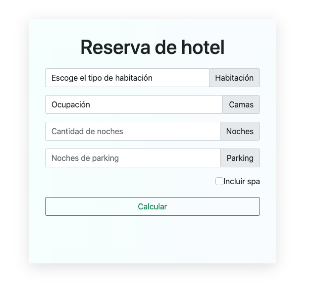
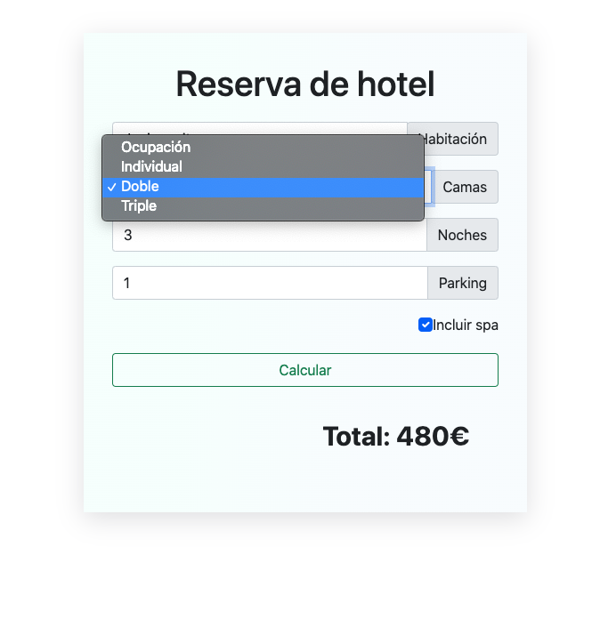
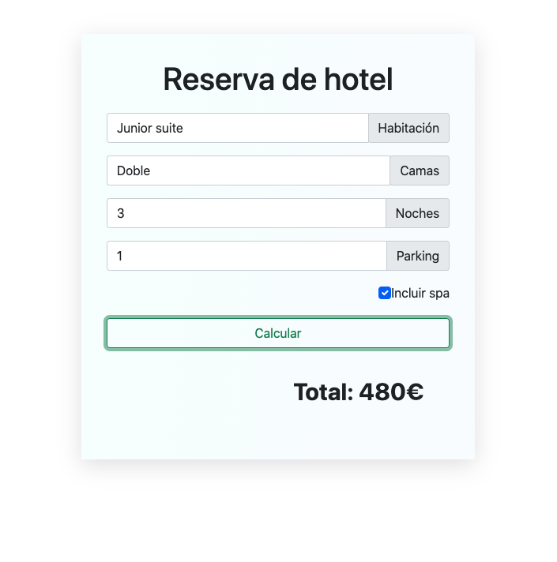

# Booking

This javascript exercise simulates a hotel reservation. In which we have the following variables:

- Room type: standard, junior or suite.
- Bed type: Single, double or triple.
- Number of nights
- Nights of parking
- Spa

The room type and bed type inputs are selects.

The inputs of nights and parking nights are of type number.

Once the fields are filled in, the total price is obtained by clicking on the calculate button.

The total value is shown at the bottom right.

